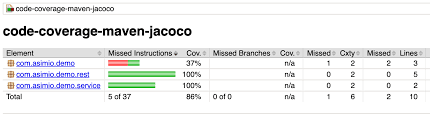

[](https://app.codacy.com/gh/Nagraggini/start-projects/dashboard?utm_source=gh&utm_medium=referral&utm_content=&utm_campaign=Badge_grade)
[](https://github.com/Nagraggini/start-projects/actions/workflows/maven.yml)


# Start-projects

Welcome! This is my collection of various programming projects, starter templates, and learning materials.

## 📝 Blog

If you are interested in how to start as a web developer, check out my book (currently only in Hungarian):          
👉 [My book - Hungarian version](https://nagraggini.github.io/my-awesome-book/)        
👉 [My java notes - Hungarian version](https://nagraggini.github.io/my-awesome-book/java.html)      

---

## 📂 Folders & Structure

- **java-console** - Basic Java programs and exercises.
- **java-console-exams** - Solutions for various Java exams. [Source](https://infojegyzet.hu/vizsgafeladatok/)
- **java-console-intermediate** - Exercises and examples using Java Stream API
- **java-gui** - Java desktop applications (Swing/JavaFX).

---

## 🛠 Tech Stack

- **Languages:** Java 21, Maven, JUnit 5, Jacoco      
- **Tools:** Git, Visual Studio Code, Codacy (Static Code Analysis)   
- 
## 👤 Author

**Andrea Freud (Nagraggini)** _Budapest, Hungary_

-------------------

Hungarian version/Magyar verzió

👉 [Könyvem](https://nagraggini.github.io/my-awesome-book/)        
👉 [Java fejezet a könyvemben](https://nagraggini.github.io/my-awesome-book/java.html)     

# Codady

https://app.codacy.com/-ra regisztrálj be.

Add hozzá a repot. Menj a repodra. -> Settings -> General -> Görgess lejebb és másold ki a jelvényt, majd rakd a README.md fájlod tetejére.

Issue summaries-t kapcsold be. Ez egy rövid szöveges leírást ad a státusz mellé, így nem csak egy pipát látsz majd, hanem azt is, hogy pl. "2 új hiba lett kijavítva".

# JUnit teszt

Hozd létre a package-t és az osztályt.

Ezt töltsd le a lib mappába:
https://repo1.maven.org/maven2/org/junit/platform/junit-platform-console-standalone/6.0.3/


VS Codeben bal alul Java projects -> Referenced Libraries melletti + jelre katt. -> Tallózd be az előbbi jar fájlt.

.vscode és bin mappát töröld ki. 
Nyomj egy Ctrl+Shift+P-t.
Írd be: "Java: Clean Java Language Server Workspace". -> Reload and delete

Bal szélén a lombikra katt és a Test Explorerben a java projekt neve melletti háromszögre kattints.

Eclipse-ben:
Jobb klikk a projekten és Build Path -> Configure Build Path -> Libraries lapfül-> Katt a Modulepath-ra és Add Library -> JUnit -> Next -> JUnit 5 -> Finish -> Aztán Apply and Close

# GitHub Actions (CI/CD) beállítása

GitHub repo -> Actions fül -> Java with Maven -> Configure -> Figyelj, hogy melyik branch van beállítva. -> 
Java verzió egyezzen azzal, amit projektben használtál. Csekk: Terminálban: java -version
A maven.yml fájlban írd át mindkét helyen, ha változott.

Ezt a két sort töröld ki, mert nincs graph.
 ```yml
     - name: Update dependency graph
       uses: advanced-security/maven-dependency-submission-action@571e99aab1055c2e71a1e2309b9691de18d6b7d6
 ```
Tabulátor érzékeny a yml fájl.

Fájl tartalma:
```yml
# This workflow will build a Java project with Maven, and cache/restore any dependencies to improve the workflow execution time
# For more information see: https://docs.github.com/en/actions/automating-builds-and-tests/building-and-testing-java-with-maven

# This workflow uses actions that are not certified by GitHub.
# They are provided by a third-party and are governed by
# separate terms of service, privacy policy, and support
# documentation.

name: Java CI with Maven

on:
    push:
        branches: ["main"] # Fontos, hogy melyik branch van beállítva.
    pull_request:
        branches: ["main"] # Fontos, hogy melyik branch van beállítva.

jobs:
    build:
        runs-on: ubuntu-latest
        permissions:
            contents: write # Github repod -> Settings -> Acions -> General -> Allow all actions and reusable workflows; Read and write permissions; Mindkét helyen nyomj ár a mentésre. -> A badge-ekhez kell.
        steps:
            - uses: actions/checkout@v4
            - name: Set up JDK 21 # Java verzió egyezzen azzal, amit projektben használtál. Csekk: Terminálban: java -version
              uses: actions/setup-java@v4
              with:
                  java-version: "21" # Java verzió egyezzen azzal, amit projektben használtál. Csekk: Terminálban: java -version
                  distribution: "temurin"
                  cache: maven

            - name: Build and Test with Maven
              run: mvn -B clean test

              # Ez a rész generálja a plecsnit a README-be a tesztfutás után!
            - name: Generate JaCoCo Badge
              id: jacoco
              uses: cicirello/jacoco-badge-generator@v2
              with:
                  generate-branches-badge: true
                  jacoco-csv-file: target/site/jacoco/jacoco.csv
            # Ez a rész pedig visszatölti a képet a GitHubra, hogy be tudd illeszteni
            - name: Commit and push the badge
              run: |
                  git config --local user.email "action@github.com"
                  git config --local user.name "GitHub Action"
                  git add .github/badges/*.svg
                  git commit -m "Updated coverage badge" || exit 0
                  git push
```

Commit changes...-re nyomj. 

Minden alkalommal, amikor push-olod a kódodat, a GitHub elindít egy VM-et.

Letölti a Java-t, lefordítja a kódot, és lefuttatja a JUnit teszteket.

Ha minden teszt lefutott, a badge "passing" (zöld) lesz. Ha egy teszt elbukik, a badge "failing" (piros) lesz. :(
Az Actions fülön látod, hogy hol hasalt el a teszt, valamint emailt is dob a github. 

Összefoglalva ez a CI/CD pipeline. 

Így adj hozzáférést a GitHub Actions-nek, ha privát a repod.
Github repod -> Settings -> Acions -> General -> Allow all actions and reusable workflows
Read and write permissions

Ahány helyen változtatsz annyi helyen kell a save-re nyomni.

## Függőségek (dependencies)

Csinálj egy pom.xml fájlt a projekt gyökér könyvtárába.

Tartalma:
```xml
<?xml version="1.0" encoding="UTF-8"?>
<project xmlns="http://maven.apache.org/POM/4.0.0"
         xmlns:xsi="http://www.w3.org/2001/XMLSchema-instance"
         xsi:schemaLocation="http://maven.apache.org/POM/4.0.0 http://maven.apache.org/xsd/maven-4.0.0.xsd">
    <modelVersion>4.0.0</modelVersion>

    <groupId>Gyakorlas</groupId>
    <artifactId>start-projects</artifactId>
    <version>1.1-SNAPSHOT</version> <!--Verzió szám.-->

    <properties> <!--Java verzió egyezzen azzal, amit projektben használtál. Csekk: Terminálban: java -version-->
        <maven.compiler.source>21</maven.compiler.source>
        <maven.compiler.target>21</maven.compiler.target>
        <project.build.sourceEncoding>UTF-8</project.build.sourceEncoding>
    </properties>

    <dependencies>
        <dependency>
            <groupId>org.junit.jupiter</groupId>
            <artifactId>junit-jupiter-api</artifactId>
            <version>5.10.0</version>
            <scope>test</scope>
        </dependency>
        <dependency>
            <groupId>org.junit.jupiter</groupId>
            <artifactId>junit-jupiter-engine</artifactId>
            <version>5.10.0</version>
            <scope>test</scope>
        </dependency>
        <dependency>
            <groupId>org.apache.commons</groupId>
            <artifactId>commons-lang3</artifactId>
            <version>3.12.0</version>
        </dependency>
    </dependencies>

    <build><!--TODO mindin mappát hozzá kell majd adni.-->
        <sourceDirectory>java-console-exams/src/main/java</sourceDirectory>
        <!-- Itt pedig a tesztek -->
        <testSourceDirectory>java-console-exams/src/test/java</testSourceDirectory>
        <plugins>
            <plugin>
                <groupId>org.apache.maven.plugins</groupId>
                <artifactId>maven-surefire-plugin</artifactId>
                <version>3.1.2</version>
            </plugin>
            <!--Teszt lefedettség méréséhez.-->
            <plugin>
                <groupId>org.jacoco</groupId>
                <artifactId>jacoco-maven-plugin</artifactId>
                <version>0.8.11</version>
                <executions>
                    <!--Ha nincs meg a 80 %-os teszt lefedettség, akkor ezzel elhasal a teszt.-->
                    <!--
                    <execution>
                        <id>check-coverage</id>
                        <goals>
                            <goal>check</goal>
                        </goals>
                        <configuration>
                            <rules>
                                <rule>
                                    <element>BUNDLE</element>
                                    <limits>
                                        <limit>
                                            <counter>LINE</counter>
                                            <value>COVEREDRATIO</value>
                                            <minimum>0.80</minimum>
                                        </limit>
                                    </limits>
                                </rule>
                            </rules>
                        </configuration>
                    </execution>
                    -->
                    <execution>
                        <goals>
                            <goal>prepare-agent</goal>
                        </goals>
                    </execution>
                    <execution>
                        <id>report</id>
                        <phase>test</phase>
                        <goals>
                            <goal>report</goal>
                        </goals>
                    </execution>
                </executions>
                <!--A html és csv, xml fájlok szép megjelenítéséhez.-->
                <configuration>
                    <formats>
                        <format>HTML</format>
                        <format>CSV</format>
                        <format>XML</format>
                    </formats>
                </configuration>
            </plugin>
        </plugins>
    </build>
</project>
```

Utána terminálba írd be, ha másolod akkor ctrl+shift+v:
**mvn clean test**

Ha a végén kiírja, hogy "BUILD SUCCESS", akkor működik minden. 

Érdemes ezt beállítani a maven.yml-ben is, hogy push után rögtön le is fusson az mvn clean test.

maven.yml fájlban már szerepel ez:

```yml
    - name: Build and Test with Maven
      run: mvn -B clean test
 ```
 Tabulátorokra érzékeny.

## Badge

Github repo -> Actions fül -> Bal oldal Java CI with Maven -> Jobb szélen felül három pötty -> 
Ha több branch-ed van, akkor megfelelőt válaszd ki. -> Copy status badge Markdown -> Illesztbe a README-d tetejére.

Le is tudod csekkolni, ha a böngészőbe beírod a weboldal linkjét. 

# Teszt lefedettség

Forráskódjaid itt legyenek:
src/main/java/bankszamlanyilvantartas/

Tesztek pedig itt:
src/test/java/bankszamlanyilvantartas/

A terminálba írd be, hogy ls -R így le tudod csekkolni, hogy tuti jó helyen van-e minden!!!

A fájlok áthelyzése után kell egy mvn clean test a terminálba. Ha létrejött a target mappád, akkor jó úton jársz. 

Böngészőben nyisd meg ezt: 
Bal oldalt keresd meg és jobb klikk Live Server -> target/site/jacoco/index.html

Online old-school paint: https://jspaint.app/

Ilyet fogsz látni:    


Bezáráskor ne csak a böngészőben zárd be a jacoco-t, hanem a vs code jobb alsó sarkában áthúzott kör Port: 5500-ra kattints. 